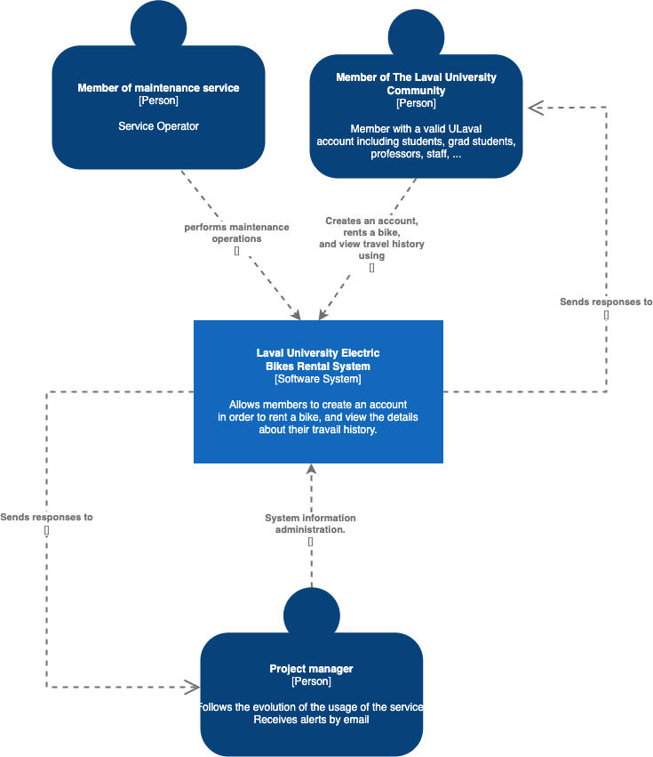
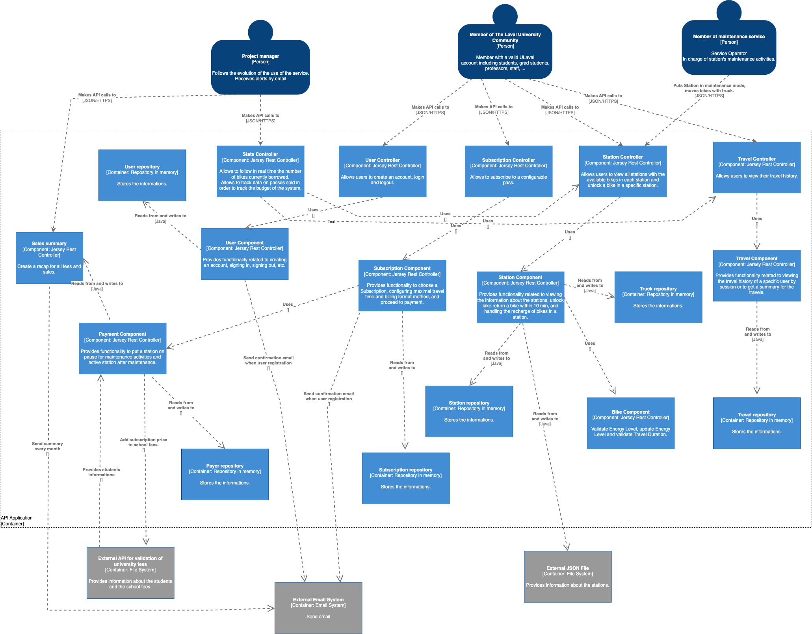

# SULVLO

SULVLO est une application permettant aux étudiants de l'Université Laval de se déplacer sur le campus universitaire utilisant des vélos électriques. L'application permet aux élèves de:

##### Aventure #1 : Alexandra, étudiante aux études graduées, revenant d’un stage aux îles de La Madeleine, veut se déplacer sur le campus avec un vélo électrique pour aller à ses cours

- Récit 1: En tant qu’Alexandra, je peux me créer un compte afin d’acheter une passe de vélo.
- Récit 2: En tant qu’Alexandra quand j’effectue une commande, je peux choisir le type de passe qui me convient pour ma session.
- Récit 3: En tant qu’Alexandra quand j’ai complété ma commande, je peux maintenant effectuer des transports à vélo.
- Récit 4: L'application permet de dévérouiller un vélo dans une station de l'Université Laval utilisant un code unique.
- Récit 5: En tant qu’Alexandra, je peux retourner le vélo pour un voyage inférieur à 10 minutes dans un emplacement libre d’une des stations du campus afin de terminer mon voyage.
- Récit 6 : En tant qu’Alexandra, je peux retourner le vélo pour un voyage supérieur à 10 minutes dans un emplacement libre d’une des stations du campus afin de terminer mon voyage et d’être chargée pour l’excédent.
- Récit 7: L'application permet de consulter mon historique d'utilisation du service.
- Récit 8 : En qu’Alexandra, je peux payer le solde de frais supplémentaires à la fin d’un mois pour acquitter les soldes que j’ai eus ce mois.

##### Aventure #2 : Francis, étudiant en philo, amoureux de jeux de société et de hike, souhaite payer à même ses frais de scolarité l’abonnement au service

- Récit 1 : En tant que Francis, je veux payer ma passe à même mes frais de scolarité de l’université afin d’avoir un compte unifié.

##### Aventure #3 : Anabelle, responsable du projet de déplacement de vélo sur le campus, amoureuse de la Hollande, souhaite suivre l’évolution de l’utilisation du service

- Récit 1 : En tant qu’Anabelle, je veux suivre en temps réel le nombre de vélos actuellement emprunté.
- Récit 2 : En tant qu’Anabelle, je veux suivre les données sur les passes vendues afin de suivre le budget du système.

##### Aventure Obligatoire: Sylvain, Réparateur de vélo, employé de la ville de Québec, proche de la retraite, doit opérer et réparer le service de vélo

- Récit 1: En tant que Sylvain, je peux mettre faire une maintenance sur une station quand il y a un problème qui m’a été rapporté afin de remettre la station en service

## Rapport MEP
- [Voir Rapport](./Rapport%20MEP%204.pdf)

## Documentation C3

### Context

### Container

### Components

C3: [https://drive.google.com/file/d/1DGsTkKY5BbwCDKyqp4XlQmb5PvFbGoK5/view?usp=sharing](https://drive.google.com/file/d/1DGsTkKY5BbwCDKyqp4XlQmb5PvFbGoK5/view?usp=sharing)

## Comment utiliser le projet

- Vous pouvez installer manuellement Java 17 et mettre à jour la variable JAVA_HOME. Cependant, nous vous recommandons d'utiliser pour gérer Java et plusieurs outils et frameworks reliés à la JVM. Cet outil va vous faciliter énormément la gestion des versions de Java et outils annexes surtout si vous en voulez plusieurs sur votre machine.
- Avec Java 17 et Maven d'installé et de configuré;

  - Pour lancer l'aplication:
    - Dans un terminal, exécutez start.sh si vous êtes sur Linux / OSX
    - Dans un terminal, exécutez start.bat si vous êtes sur Windows
    - Dans un IDE, exécutez la classe `SulvloMain` en tant que "Java Application"

Une fois lancé les routes de SulVlo seront disponible sur l'adresse [http://localhost:8080/api/](http://localhost:8080/api/)

# Liste des routes

- [User](docs/user.md)
- [Subscription](docs/subscription.md)
- [Station](docs/station.md)
- [Bike](docs/bike.md)
- [Travel](docs/travel.md)
- [Maintenance](docs/maintenance.md)
- [Truck](docs/truck.md)
- [Payment](docs/payment.md)
- [Stats](docs/stats.md)
